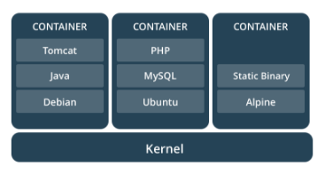
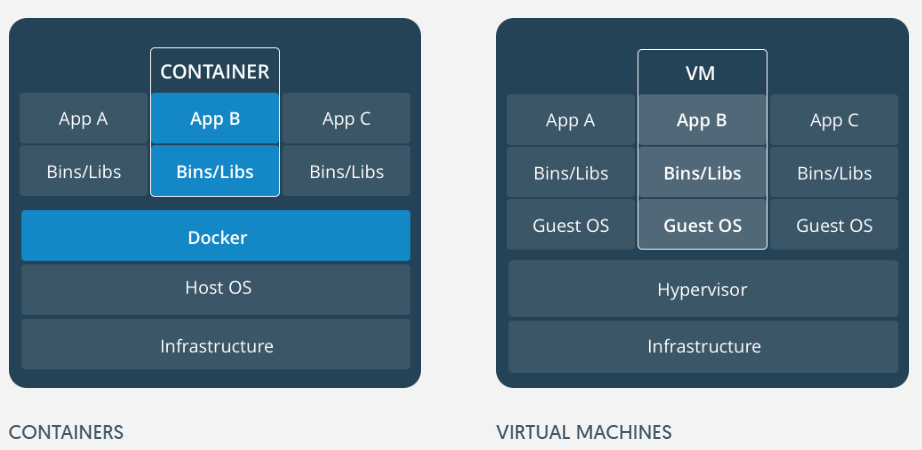
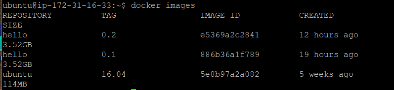
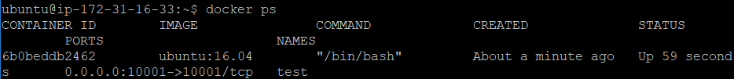

# Why docker?

_____________________

## 상황 1

팀 프로젝트를 하게 된 와빅이. 그렇지만 한 명은 맥을 쓰고 와빅이는 윈도우를 쓴다.

또한 깔려있는 파이썬 라이브러리의 버전 역시 다르다.

문제가 발생하지 않으면 다행이지만, 와빅이의 컴퓨터에서는 되던게 팀원의 컴퓨터에서는 작동하지 않는다.

어떻게 해야할까?
_________________
## 상황 2

여러 컴퓨터를 연결하여 분산처리를 시도하는 와빅이. 하지만 분산처리를 하기 위해서는 모든 컴퓨터에 spark, hadoop, hive 등이 똑같이 깔려있어야 한다.

그렇다면 와빅이는 10대의 분산처리를 하려고 할 때 10대 모두에 엔지니어링 첫 수업처럼 환경셋팅하는 걸 10번 반복해야 할까?
___________________
# 도커란 `초경량 가상머신` 이다.
____________________
# 도커의 기능


한 컴퓨터 위에 여러 개의 컨테이너($\simeq$가상머신)을 운영할 수 있다.
### $\rightarrow$ 호스트와 컨테이너를 분리시킨다!

__________________________

## 가상머신과 컨테이너의 차이


________________

- 가상머신
  - 게스트 운영체제를 돌려야 하기 때문에 성능이 떨어진다.
  - 용량이 불필요하게 크다.
- 컨테이너
  - 게스트 운영체제가 필요없기 때문에 성능이 좋다. (host의 95%까지도 가능)
  - 필요한 library등만 설치하여 가볍다.

____________________

## 컨테이너와 이미지

### 이미지


_____________________

### 컨테이너


_________________________

## 상황 1 해결법

### 1. 둘 다 도커를 설치한다.

### 2. 도커에서 ubuntu16.04 이미지를 다운로드한다.

### 3. 우분투 이미지로 컨테이너를 만들어, 컨테이너에서 작업한다.

_____________________

## 상황 2 해결법

### 1. 상황에 필요한 도커 이미지를 만든다.

### 2. 모든 컴퓨터에서 docker build만 하면 똑같은 환경이 탄생한다.

___________________

# 도커CE 우분투에 설치하기
____________
# 필요한 패키지 설치
```sh
sudo apt-get update
sudo apt-get install \
    apt-transport-https \
    ca-certificates \
    curl \
    software-properties-common
```
_____________
# 도커 repo 추가하기

```sh
curl -fsSL https://download.docker.com/linux/ubuntu/gpg \
| sudo apt-key add -

sudo apt-key fingerprint 0EBFCD88

sudo add-apt-repository \
   "deb [arch=amd64] https://download.docker.com/linux/ubuntu \
   $(lsb_release -cs) \
   stable"
```
___________________
# 도커CE(community edition) 설치
```sh
sudo apt-get update
sudo apt-get install docker-ce
```
# sudo 없이 docker 사용하기
```sh
sudo groupadd docker
sudo usermod -aG docker $USER
# 이후 다시 로그인 할 때부터 적용
```
__________________
# 테스트
```sh
docker run hello-world
```
_________________

# 명령어 소개
____________
# 존재하는 이미지를 찾기
### 1. [dockerhub](https://hub.docker.com/)에서 검색
github처럼 image들이 모여있는 사이트
### 2. 명령어 사용
```sh
docker search IMAGENAME
```

# 이미지 설치
```sh
# ubuntu16.04 이미지 설치
docker pull ubuntu:16.04
```


_____________________

# 다운받은 이미지 확인

```sh
docker images
```



________________________

# 이미지로부터 컨테이너 생성하기

```sh
docker run [OPTIONS] IMAGE [COMMAND]
```

## 주요 옵션

| 명령어 | 설명                                        |
| ------ | ------------------------------------------- |
| -d     | 컨테이너를 back ground에서 돌린다.          |
| --name | 컨테이너에 이름을 붙인다.                   |
| -p     | 컨테이너의 포트와 호스트의 포트를 연결한다. |
| -it    | bash shell 연결하기                         |
| -v     | 호스트의 폴더와 컨테이너의 폴더를 연결한다. |

______________________

## 예시

```sh
docker run -it --name test -p 10001:10001 ubuntu:16.04 /bin/bash
# ubuntu16.04 이미지를 이용하여 test란 이름의 container를 만들어
# bash창을 실행하고 bash shell에 접속한다.
# 이때 host의 10001포트와 container의 10001번 포트가 연결된다.
```


______________________

# 컨테이너 확인

```sh
docker ps
# 실행중인 컨테이너 확인
```



```sh
docker ps -al
# 정지된 컨테이너까지 모두 확인
```

_______________

# 컨테이너 명령어

```sh
docker stop test
# test라는 컨테이너를 중지한다.

docker start test
# test라는 컨테이너를 다시 시작한다.

docker rm test
# test라는 컨테이너를 삭제한다.

docker attach test
# test라는 컨테이너에 접속한다.
```
_________________

# 새로운 이미지 만들기

____________________

# 2가지 방법

## 1. 컨테이너를 이미지로 만든다.

## 2. dockerfile을 활용한다.

__________________

# 도커의 image layer system


출처 : https://subicura.com/2017/01/19/docker-guide-for-beginners-1.html

### $\rightarrow$ ubuntu이미지로 만든 컨테이너에  python을 깔고 이미지로 만든다면, 다음부터 python을 깔지 않아도 된다!

________________________

# 실습 1

## ubuntu container에 jupyter notebook 설치한 image 만들기

```sh
docker commit CONTAINER IMAGE_NAME
```

________________

# 실습 2

## Dockerfile로 만들기

```sh
docker build --tag jupyter:0.1 .
```
_________________
# 참고자료
- [docker document](https://docs.docker.com/)
- [가장 빨리 만나는 도커](http://pyrasis.com/docker.html)
인터넷 무료 공개 도서
 


